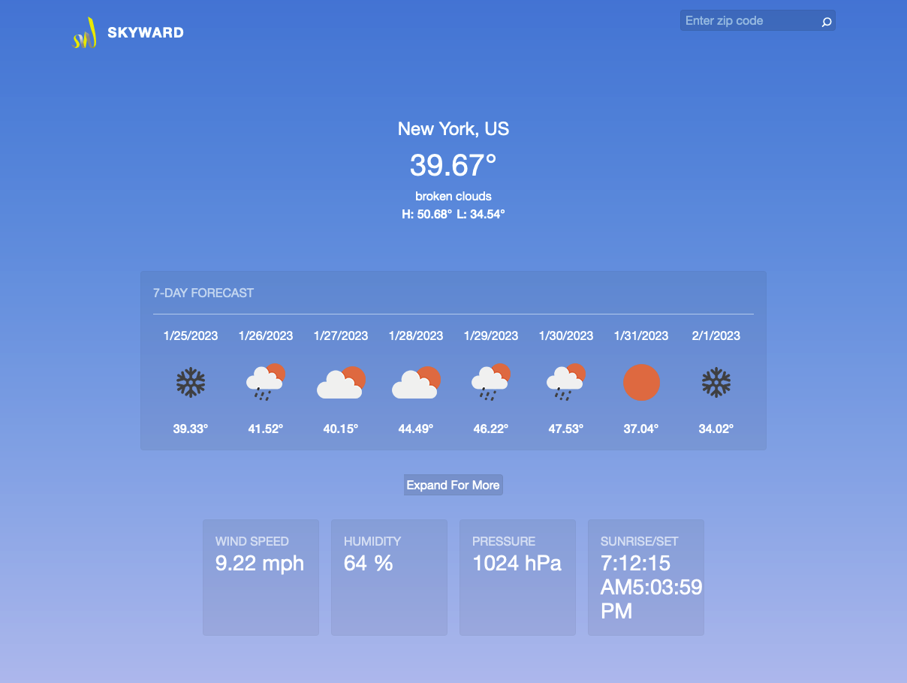

# Front End Assignment

<div id="top"></div>

<!-- PROJECT LOGO -->
<br />
<div align="center">
  <a href="https://github.com/danjkim21/frontend-homework">
    
  </a>

<h3 align="center">SKYWARD</h3>
<p align="center">Weather App</p>

  <p align="center">
    Skyward IT Solutions front end assignment
    <br />
    <a href="https://skyward-assignment.netlify.app/">View Live Site</a>
  </p>
</div>

<!-- ABOUT THE PROJECT -->

## About The Project

<p align="center">
  
</p>

### How It's Made

**Tech used:**

- [React](https://reactjs.org/)
- [OpenWeatherMap API](https://openweathermap.org/api)

This fully responsive web application is built using react and the OpenWeatherMap API. By default, users will see current conditions for New York, US, as well as a 7-day forecast. In addition, users can toggle the "Expand For More" button to view additional data related to wind speed, humidity, air pressure, sunrise time, and sunset time.

Users can also search for weather by zipcode by entering it into the search bar on the top right and clicking on the search icon.

The project was heavily inspired by the iOS weather app. I just really like the design of it!

**Displayed Data:**

- Show the "current" conditions for New York:

  - Location (ie. New York, NY, USA)
  - Current weather description (ie. sunny)
  - Current temperature
  - Today's high temperature
  - Today's low temperature

- Allow the user to toggle more data in the current conditions area:

  - Wind Speed
  - Humidity
  - Pressure
  - Sunrise/Sunset Time

- Show the 7 Day forecast

<!-- GETTING STARTED -->

## Getting Started

This app can be accessed live via [skyward-assignment.netlify.app](https://skyward-assignment.netlify.app/) or as a local copy. To get a local copy up and running follow these simple example steps.

### Installation

1. Clone the repo
   ```sh
   git clone https://github.com/github_username/repo_name.git
   ```
2. navigate into the folder
   ```sh
   cd weather-react-app
   ```
3. Install NPM packages
   ```sh
   npm install
   ```

<!-- USAGE EXAMPLES -->

### Usage

1. Login and create an API key for [OpenWeatherMap](https://openweathermap.org/api)

2. create .env file and save api key as:

   ```sh
   VITE_API_KEY = '1234abcdefg12345'
   ```

3. Run server
   ```sh
    npm run dev
   ```
4. Navigate to server
   ```sh
   `localhost:5173`
   ```

## Optimizations:

In order to complete the assignment in roughly a few hours, there were certain design considerations that I omitted for the sake of time.

First, I typically include linting (ESlint - AirBnB styling), testing (Jest), in order to keep my project scaleable. I have begun exploring TypeScript for its static typing. Given more time, I would implement these tools in the begining.

Second, for small-medium size projects, I typically breakdown my `src` folder structure into `assets` (images, etc.), `components` (buttons, nav, etc.), `pages` (landing, about, etc.), `hooks` (useEffects, useRefs, custom hooks etc.) in order to better abstract my codebase into modular pieces. But for the sake of time, I kept all my hooks and functions within the main `app.jsx` file and passed down relevant hooks and state down.

Third, when using `fetch` or any type of API calls, I typically try to stay away from fetching data within a `useEffect` and jump over to React Query. This state management library is extremely helpful behind the scenes and is useful when scaling apps. But to keep things simple, the `useEffect` hook gets the job done!

Fourth, with `useEffect`, I typically try to abstract these hooks to be more specific by creating them instead as custom hooks and import them into components/pages only when required. This helps to reduce overall code cleanliness and impact of change.

Lastly, I would love to be able to add more custom animations and features. One idea would be to display a new background color/image based on the current weather conditions(ie. sunny - bright orange). I also was considering deconstructing the Skyward website traveling cloud animation from the hero section but left it out due to time.

## Design Process:

I start all my projects by first laying out all the project requirements (data, APIs, etc.) for a minimum viable project (MVP), the app logic and how state changes with user interaction, and a basic wireframe. All of which helps me to break larger components of my UI into smaller, reuseable components, in the effort to keep my code DRY (Don't Repeat Yourself!).

### MVP Ideation

<p align="center">
  
</p>

### App Flow/Logic

<p align="center">
  
</p>

### App Design

<p align="center">
  
</p>

## Contact

Daniel Kim - dan.jkim21@gmail.com

Live Link: [https://ardb.vercel.app/](https://ardb.vercel.app/)

<p align="right">(<a href="#top">back to top</a>)</p>
